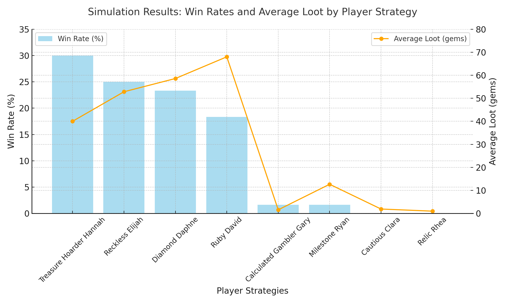

#  Project Report
**Group Members**
1. Elijah Charles

# Summary of Game
This game, famously known by explorers as Incan Gold and other adventurers as Diamant, is a thrilling expedition into the heart of ancient, 
treasure-filled caves. Over five daring days, players take on the roles of brave explorers, pushing their luck to uncover priceless Treasures and mythical Relics. 
But beware, each step deeper into the cave brings greater riches and danger, as deadly Traps like rolling boulders and venomous snakes lurk in the shadows. 
Will you press on for glory or retreat with your hard-earned loot? The choice is yours in this game of risk and reward. The links:

https://boardgamegeek.com/boardgame/15512/incan-gold

https://drive.google.com/file/d/1EvoGn3tSHPMO9UPOnrOgL3_hClCilLOk/view?usp=sharing

# Experiment Report
## Player Strategies
1. Cautious Collector: The Cautious Collector values safety above all else, choosing to leave the cave after accumulating a moderate amount of loot, such as 20 gems. 
This strategy ensures players avoid unnecessary risk by retreating before encountering traps. The Cautious Collector sacrifices opportunities for larger rewards deeper in the cave for the peace of mind that comes with consistent gains. 
This method shines in the game with unpredictable traps or high risk, as it minimizes potential losses. By prioritizing smaller but frequent successes, 
this approach offers a reliable way to build treasure over the course of the game’s five days.
2. Reckless Risk-Taker: The Reckless Risk-Taker thrives on the thrill of danger, staying in the cave until a trap forces them to exit. 
This strategy ignores caution, aiming to collect as much treasure as possible before disaster strikes. It’s a Go big or Go home approach that often results in dramatic outcomes, 
ranging from monumental wins to devastating losses. This strategy relies on luck, making it the most unpredictable choice in the game. While it may appear reckless, its potential for high rewards appeals 
to players who enjoy the excitement of pushing their luck and risking it all for massive gains.
3. Aggressive Diamond Seeker: The Aggressive Diamond Seeker is laser-focused on collecting diamonds, the most valuable treasures in the game. 
This strategy involves exiting the cave as soon as the player accumulates a set number of diamonds, such as five. It balances the risk of lingering in the cave for too long with the reward of securing high-value loot. 
This strategy is effective in games where diamonds frequently appear, offering a clear goal while avoiding unnecessary exposure to traps. 
By focusing on a single, high-value treasure type, this strategy is ideal for players who prefer quality to quantity in their loot.
4. Ruby Priority Seeker: The Ruby Priority Seeker specializes in collecting rubies and exiting the cave after amassing a specific number, such as eight. 
This strategy provides a clear objective, allowing the player to focus on accumulating a steady flow of loot. While rubies are less valuable than diamonds in the game, they are often easier to find, making this approach more reliable. 
The Ruby Priority Seeker minimizes risk by setting achievable goals and leaving the cave before encountering too many traps. 
This strategy is perfect for players who want consistent progress without the unpredictability of targeting rare or high-value treasures.
5. Relic Hunter: The Relic Hunter values the rare and mystical over sheer volume, prioritizing the acquisition of relics. This strategy involves exiting the cave immediately after securing a relic, which often provides bonus points. 
Relics are challenging to obtain in the game but can significantly boost a player’s score, making this strategy highly rewarding when executed successfully. The Relic Hunter’s single-minded focus minimizes exposure to danger, 
as they often leave the cave quickly. This approach suits players who value precision and efficiency, offering a thrilling quest for rare treasures while minimizing the risks associated with deeper explorations in the game.
6. Calculated Gambler: The Calculated Gambler takes a flexible approach, adapting their decisions based on their current score and situation. 
They take more significant risks if trailing behind, staying in the cave longer to accumulate more loot. When leading, they play cautiously, exiting early to protect their advantage. 
This dynamic strategy requires careful assessment of game conditions and the balance of risk and reward. The Calculated Gambler shines in competitive games where strategies evolve. 
This versatile approach rewards analytical thinking and adaptability, making it an ideal choice for players who enjoy strategizing and adjusting their plans based on the unfolding game.
7. Milestone Seeker: The Milestone Seeker approaches the game with a structured mindset, leaving the cave whenever their loot reaches a predefined milestone, such as multiples of 10. 
This strategy emphasizes consistency and steady progress, avoiding the extremes of excessive risk-taking or premature exits in the game. By setting clear goals, the Milestone Seeker ensures a predictable pace of treasure accumulation 
while maintaining a sense of safety. This approach is incredibly efficient in games with balanced treasure distribution, as it provides a decision-making framework. 
The Milestone Seeker is ideal for players who value methodical play and consistent rewards in the game.
8. Treasure Hoarder: The Treasure Hoarder embodies ambition, staying in the cave until amassing a large amount of loot, such as 100 gems. 
This bold strategy focuses on maximizing rewards, often pushing players to the limits of their risk tolerance. While this approach offers the potential for enormous gains, it comes with significant danger, 
as traps can wipe out all accumulated loot. The Treasure Hoarder is a high-stakes strategy that requires patience and confidence, appealing to players who are willing to gamble everything for a shot at victory. 
It’s a thrilling, audacious approach for those who crave excitement and big wins.

## Procedure
The experiment aimed to evaluate the effectiveness of eight distinct player strategies in the game of Incan Gold. These strategies included Cautious Collector, Reckless Risk-Taker, Aggressive Diamond Seeker, Ruby Priority Seeker, Relic Hunter, Calculated Gambler, Milestone Seeker, and Treasure Hoarder, each reflecting unique risk-reward decision-making styles. The objective was to determine which strategy achieved the highest success rate by maximizing treasure collection while minimizing forced exits due to traps.

To simulate the experiment, eight players were assigned these strategies and competed against one another in 60 trials, each representing a full game consisting of five in-game days. Players encountered treasure tokens, relics, and traps as they navigated the game, with their decisions automated through our code. Each strategy’s logic dictated when players would continue exploring or leave the cave to secure their loot. The randomized nature of the Expedition Deck ensured diverse and unpredictable game scenarios.
Key metrics collected included the number of wins per strategy, average loot collected, and the frequency of safe exits versus forced exits. By running the experiment over a significant number of trials, we aimed to reduce variability and draw meaningful comparisons. Data from each trial were aggregated into tables and charts, highlighting the performance differences among the strategies.

This rigorous setup provided a comprehensive understanding of how different strategies performed under varying game conditions, offering insights into their risk tolerance, decision-making effectiveness, and ability to adapt to unpredictable scenarios. The results were analyzed to identify the most successful strategy in balancing risk and reward.

## Results
The Incan Gold game simulation revealed a wide range of performances among the eight-player strategies, highlighting the varying effectiveness of risk-taking and goal prioritization. The Treasure Hoarder Hannah dominated the competition, winning 30% of the games with an average loot collection of 40 gems. This strategy’s balanced approach of waiting until sufficient treasures are collected proved consistently reliable in the game. Close behind, Reckless Elijah, with a bold risk-taking approach, secured 25% of the wins and had an average loot of 52.83 gems. Diamond Daphne, though slightly less successful in terms of wins at 23.33%, collected an impressive 58.58 gems on average, showcasing the strength of a focused goal of acquiring diamonds.

Despite winning fewer games at 18.33%, Ruby David demonstrated the highest average loot of 68 gems, emphasizing that prioritizing rubies can yield significant rewards even if it doesn’t consistently lead to victories. However, strategies like Calculated Gambler Gary and Milestone Ryan struggled to remain competitive, with each winning only one game and collecting minimal loot on average, at 1.58 and 12.67 gems, respectively. Their overly specific conditions for leaving the cave often left them exposed to traps in the game.

Cautious Clara and Relic Rhea failed to secure any wins, collecting an average loot of just 1.92 and 1 gem, respectively. Their highly conservative or specialized strategies proved ineffective in dynamic game scenarios. Overall, the results show that balancing risk and reward is key to success, while overly cautious or rigid approaches often fall short in competitive settings.

**Graph Image:**

**Result Table:**

| Player Name           | Wins (%) | Average Loot (gems) | Wins Count |
|-----------------------|----------|---------------------|------------|
| Treasure Hoarder Hannah | 30.00%   | 40.00               | 18         |
| Reckless Elijah       | 25.00%   | 52.83               | 15         |
| Diamond Daphne        | 23.33%   | 58.58               | 14         |
| Ruby David            | 18.33%   | 68.00               | 11         |
| Calculated Gambler Gary | 1.67%    | 1.58                | 1          |
| Milestone Ryan        | 1.67%    | 12.67               | 1          |
| Cautious Clara        | 0.00%    | 1.92                | 0          |
| Relic Rhea                     | 0.00%    | 1.00                | 0          |

## Analysis

When I dug into the simulation results, I saw clear differences in how each strategy performed and why some outshone others. Treasure Hoarder Hannah came out on top for me—she won 30% of the games and averaged 40 gems. I read that success as a smart balance of risk and reward: stay in the temple long enough to scoop real loot, but bail before the traps spring. That beat both the ultra-cautious and the overly bold approaches.

Reckless Elijah also did well in my runs, winning 25% of the games with an average haul of 52.83 gems. The catch I noticed was volatility: when traps were scarce, Elijah looked brilliant, but back-to-back traps often knocked him out early and wiped loot. The win rate lagged Hannah’s slightly, but the higher average loot showed that taking big swings can pay off—just not reliably.

Diamond Daphne followed close behind in my tests, winning 23.33% of the games and averaging 58.58 gems. Focusing on diamonds worked nicely when diamond tokens were plentiful; when they weren’t, Daphne struggled. I found the specialization great for loot totals, but it didn’t flex well across different game conditions.

Ruby David was the intriguing one. Even though the win rate was only 18.33%, the average loot topped the chart at 68 gems. From what I saw, prioritizing rubies—often easier to pick up than diamonds—can be hugely rewarding. Still, the lower win rate told me that single-minded treasure hunting leaves you exposed to traps and missed opportunities elsewhere.

Meanwhile, Calculated Gambler Gary and Milestone Ryan barely made a dent in my simulations—each won only one game. Gary’s “leave only under specific conditions” approach felt too brittle; it missed windows the dynamic game state offered. Ryan’s rigid milestone-hitting plan was easy to read and punish, and it showed in the low average loot of 12.67 gems.

At the bottom for me were Relic Rhea and Cautious Clara, neither of which secured a win. Rhea’s relic obsession was just too situational to matter most of the time. Clara’s hyper-conservative “leave at the first hint of danger” style netted almost nothing—an average of 1.92 gems—and, unsurprisingly, no victories.

Overall, my takeaway is that the strategies that intentionally balance risk and reward—like Treasure Hoarder Hannah (and, in a swingier way, Reckless Elijah)—perform best across runs. Focused plays like Ruby David can spike high rewards, but they’re inconsistent. Overly rigid or timid plans, such as Calculated Gambler Gary and Cautious Clara, just don’t adapt to what the game throws at you. In this unpredictable setting, I found adaptability and calculated risk-taking to be the real winning edge.

### What generative AI did I use, and what tasks did I use it for?
For my project, I leveraged ChatGPT in a complementary role, focusing on tasks where complexity required additional insight or clarity. While most of the codebase, implementation, and overall design were my efforts, ChatGPT was an invaluable tool for enhancing specific aspects. One key area was code documentation. While I wrote the initial comments, ChatGPT helped refine the structure and language of my Javadoc comments, ensuring they met the required standards and effectively communicated the purpose of my methods, classes, and variables. Also, it taught me how to create the Javadoc directory.

Additionally, I consulted ChatGPT during debugging. It served as a second perspective for particularly tricky sections of my code, offering suggestions to identify logical gaps or inefficiencies. Test case writing was another area where ChatGPT proved helpful. While I outlined and executed most of my tests independently, ChatGPT provided ideas for edge-case scenarios, ensuring my tests were comprehensive and accounted for unexpected inputs.

Overall, ChatGPT acted as a supportive tool rather than the driving force, enhancing my efforts in complex tasks while I retained control over creative and logical decision-making.

### How did I learn about the tools I used?
I learned the tools I used through curiosity, exploration, and trial. ChatGPT entered my workflow after I started looking for ways to improve efficiency and tackle complex tasks. At first, I tried it as a way to get fresh perspectives for debugging. I’d used ChatGPT on personal projects before, and after a quick walkthrough this time, I saw its potential.

The decision to incorporate it wasn’t immediate. I explored its features, experimented with prompts, and evaluated how relevant it was to my needs. I also leaned on online tutorials, informal YouTube walkthroughs, and plenty of trial-and-error. I quickly discovered that while it could answer technical questions, its real value for me was in proposing structured edge-case test scenarios and helping me produce professional-level documentation.

The tools I used for running simulations and generating visualizations were already familiar. I worked with IntelliJ IDEA and Gradle for my Java-based work, drawing on what I’d practiced in labs and prior projects. Overall, learning and adapting these tools strengthened my own process. I didn’t just rely on tutorials; I learned by experimenting, reflecting on what worked (and what didn’t), and iterating on my approach.

### Reflecting on my experience:
Using generative AI in this project provided both advantages and lessons. One of the most rewarding aspects was how it streamlined complex tasks. For instance, I leaned on ChatGPT to help structure and refine Javadoc comments and test cases, particularly for scenarios that required a careful balance between functionality and clarity. Its ability to generate structured responses and propose alternate solutions helped me navigate technical hurdles, saving time that I could reinvest into analyzing and refining my code. It was like having an assistant ready to brainstorm solutions at any hour—especially helpful with a variable schedule.

What worked incredibly well was AI’s ability to handle the more technical and tedious aspects of the project, such as suggesting specific improvements to my testing framework or simplifying intricate logic without compromising functionality. It served as a safety net, keeping my work on track when I was tackling challenging concepts like strategy implementation or simulation procedures.

However, there were moments when generative AI fell short. At times, it generated solutions that, while logical, didn’t align with the specific needs of my project. It occasionally missed nuances in certain strategic elements of the game, leading to suggestions that, on review, weren’t practical. These moments highlighted the importance of maintaining a critical perspective when working with AI-generated output. Blind reliance could have introduced inefficiencies or even errors in my code.

A key limitation I encountered was context awareness. ChatGPT often provided generic advice that required significant tweaking to fit my specific use case. For example, while it excelled at creating initial test cases, I had to revise many of them to align with the project’s unique logic. This revealed the tool’s inability to fully grasp the broader context, which reinforced the indispensable role of human judgment and domain expertise.

That said, generative AI undeniably influenced the evolution of my solution. It enabled me to adopt a more iterative approach—quickly prototyping ideas, assessing their feasibility, and refining them based on feedback. This cycle improved the project’s overall quality by encouraging experimentation without the fear of losing time. The solution I arrived at felt more robust and thoughtfully constructed because I could dedicate more mental bandwidth to the creative and strategic aspects of the game.

In hindsight, one improvement would have been engaging the AI earlier in the brainstorming phase. While I used it effectively for troubleshooting and refinement, it could have provided valuable inspiration during planning. Integrating a more dynamic scoring system or adding unique, game-changing relics could have elevated the gameplay further. Overall, generative AI enhanced my workflow, clarified complex tasks, and introduced efficiencies that would have been difficult to achieve otherwise. At the same time, it underscored the importance of human oversight and critical thinking. Striking the right balance between AI’s capabilities and my own creativity and expertise was key to navigating this project effectively.

# Other notes:
Complex Class Structure: I built the project on a carefully designed structure with interdependent classes such as Players, Game, ExpeditionDeck, and SimulationResult. I incorporated abstract classes like AdventureToken and a functional interface (Strategy) to keep the code modular, reusable, and flexible.

Advanced Use of Java Features: I used Java lambda expressions in the Strategy interface to define dynamic player behaviors concisely. I also implemented enums (TrapToken, TreasureType) to manage game elements cleanly and improve logic clarity.

Sophisticated Algorithms in Strategies: I implemented a range of strategies that mirror real-world decision-making. For example, the Calculated Gambler strategy dynamically adjusts decisions based on factors like treasure accumulation and risk thresholds.

Javadoc Documentation: I generated a comprehensive Javadoc directory covering the entire project. Every class, method, and field is thoroughly annotated to aid clarity for developers and reviewers, improve maintainability, and serve as a detailed reference for future work.

Insightful Reflections on AI: My reflections critically assess how AI supported difficult tasks—such as refining algorithms and managing dependencies—while also acknowledging its limitations. I kept a balanced, critical perspective on AI’s role in development.